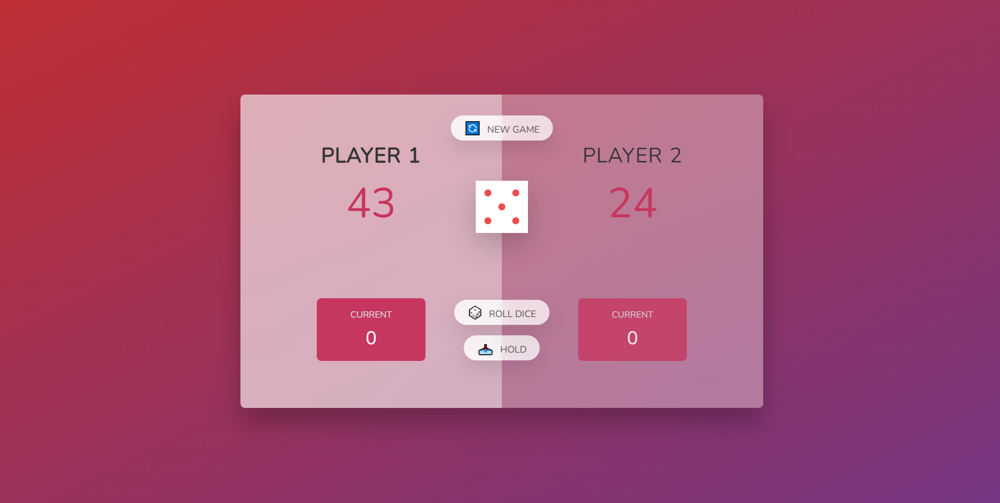

# Javascript - Building a Dice game.

This is a project that integrates the fundamentals of Javascript together with DOM manipulation to build a duo-player dice game that is fully functional and interacive.

## Table of contents

- [Overview](#overview)
  - [Screenshot](#screenshot)
  - [Links](#links)
- [My process](#my-process)
  - [Built with](#built-with)
  - [What I learned](#what-i-learned)
- [Author](#author)
- [Acknowledgments](#acknowledgments)

## Overview

The project, as small as it is is bundled with various Javascript basics including: variables, functions and ultimately the DOM manipulation.

### The Game

- The game starts with player one as the primary player.
- When you click on the roll dice button, the dice is rolled and the rolled dice is displayed on the screen. This continues until the player rolls a one (1) when the game switches to the next player.
- As the player rolls the dice, the current score is updated (added to the previous score) until a 1 is rolled and the current score is reset to zero.
- When you click on the hold button, the current score of the active player is displayed on the final score area (Under the player numbers) and then the game switches to the next player.
- The first player to reach a cumulative score of 100+ wins the game and the buttons are no longer functional as the game has ended.
- You can restart the game by clicking on the new game button.

### Screenshot



### Links

- Live Site URL: [Dice-game](https://dice-game-stegeek.vercel.app/)

## My process

- The first thing I did in the Javascript script was to select all the elements I needed to manipulate and work with.
- I have commented on the code to show the steps that I took while building this project while learning on Jonas Schemdtmann's Javascript course.

### Built with

- Semantic HTML5 markup
- CSS custom properties
  -Javascript - DOM Manipulation.

### What I learned

I was merried by how fun and easy it is to implement the switch player concept of the game.

```js
//functions
const switchPlayer = () => {
  let activePlayer = 0;
  document.getElementById(`current--${activePlayer}`).textContent = 0;
  currentScore = 0;
  activePlayer = activePlayer === 0 ? 1 : 0;
  player0.classList.toggle('player--active'); // Classes already defined in the CSS file.
  player1.classList.toggle('player--active');
};
```

## Author

- Twitter - [@Steve_thedev](https://twitter.com/Steve_thedev)

## Acknowledgments

I would like to acknowledge and thank Jonas Schmedtmann for his Javascript course which I have been using for sometime now to learn Javascript.
